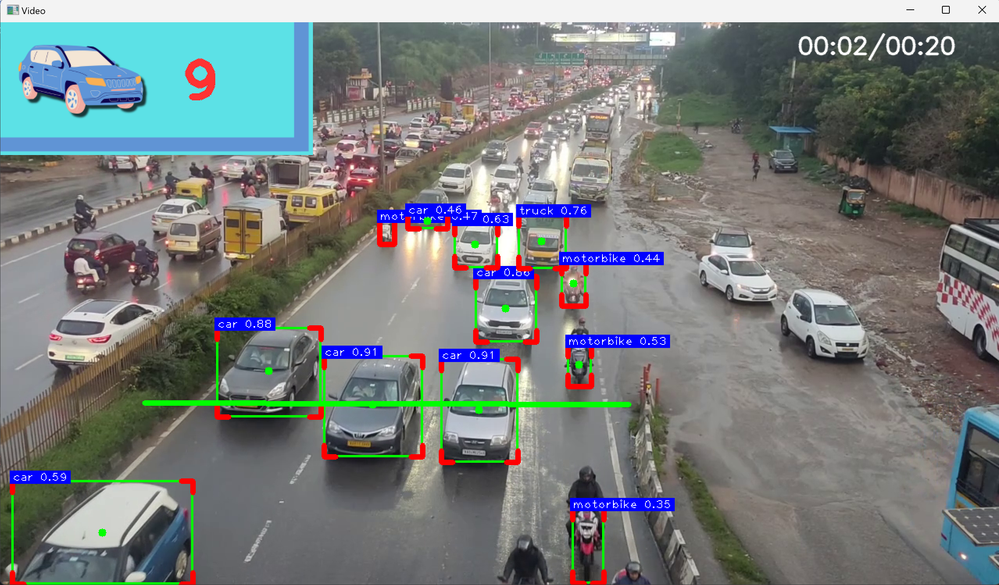
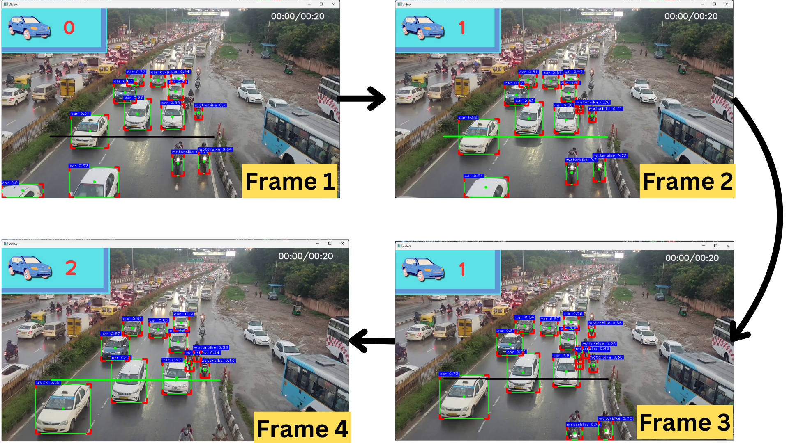

# Object-Detection-on-CCTV-Footage-YOLOv8
This is my final semester Major Project , Object detection and objects counting from CCTV Footage using YOLOv8

Monitoring CCTV footage manually is time-consuming and error-prone. Automated solutions are required for efficient real-time object detection and tracking.

Develop an automated system using YOLOv8 to detect and track vehicles in CCTV footage, with the ability to count vehicles as they cross a predefined line.

- Implemented **YOLOv8** for real-time vehicle detection.
- Used **SORT (Simple Online and Realtime Tracking)** for object tracking.
- Designed a vehicle counting system based on crossing a predefined line.

### **Result**  
The system accurately detects, tracks, and counts vehicles in real-time, improving efficiency in traffic monitoring and security surveillance.

---

## Tools Used
- **YOLOv8**: Real-time object detection.
- **SORT**: Object tracking algorithm.
- **OpenCV**: Video processing and visualization.
- **Python**: Programming language.

## Setup Instructions
1. Clone the repository: `git clone <repo_url>`
2. Install dependencies: `pip install -r requirements.txt`
3. Download YOLOv8 weights and place them in the `weights/` folder.
4. Run the script: `python object_detection.py`

---

